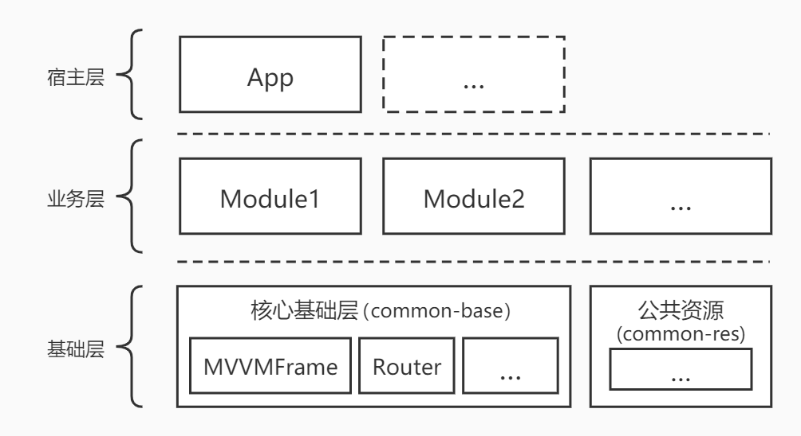

# MVVMFrameComponent

基于 [MVVMFrame](https://github.com/jenly1314/MVVMFrame) 框架为核心基础库构建的组件化方案

### 主要使用的核心技术

* JetPack(Lifecycle，LiveData，ViewModel，Room)
* Dagger
* DataBinding
* Retrofit
* OkHttp
* Glide
* Kotlin coroutines
* ARouter

## 架构

因为组件化的核心基础库是基于 **MVVMFrame**，这里贴出 **MVVMFrame** 的架构图如下：

## 浅谈组件化

1. 什么是组件化？
> 组件化简单概括就是把一个功能完整的 **App** 或 **模块** 拆分成多个子模块, 让每个子模块可以独立编译和运行, 也可以作为 **library** 合并到宿主App组成一个完整的 **App**进行编译和运行。每个模块即可以不相互依赖，又可以相互交互。

2. 为什么要组件化？
> 当一个项目随着时间的推移，需求不断的变更与迭代。各个模块也会变的相对复杂。维护难度也会随之增加，时间久了，可能会引起一些新的问题。这时我们就需要组件化。

3. 组件化的优势是什么？
> 当一个App使用组件化开发方案时，主要的优势有：组件化拆分各个模块后，每个子模块都可以独立编译和运行，这样在开发调测某个模块时，可以大大提高编译速度和开发效率。多人开发时，每个人负责独立的模块，更有利于多人团队协作开发。并且各个模块之间的代码边界相对清晰，更易于后期维护。

## MVVMFrameComponent 组件化方案

**MVVMFrame** + **Component** = **MVVMFrameComponent**。即 **MVVMFrameComponent** 采用 **MVVM** 模式架构的组件化方案。

## 工程各个 Module 相关说明

### app
宿主App：当各个子 **Module** 作为 **library** 时，则可将所有组件集成到 **宿主App** 中。此时 **宿主App** 则是一个拥有所有组件功能集合的完整的App。

### common-base
组件化公共基础库：主要包含 **MVVMFrame** 快速开发框架，和作为组件化的一些公共的核心基础库，方便快速构建组件化 **Project**。

### common-res
组件化公共资源库：主要方便统一管理各个 **Module** 中的一些公共资源相关。

### module-joke
一个简单的笑话功能模块：主要用来展示基于 **MVVMFrame** 来实现组件化开发，作为组件化开发的 **Module** 实现示例之一。

### module-news
一个简单的新闻功能模块：主要用来展示基于 **MVVMFrame** 来实现组件化开发，作为组件化开发的 **Module** 实现示例之一。

### 其它说明
**Project** -> **build.gradle** 内的自定义变量 **isBuildModule**
> 自定义变量 **isBuildModule** 来统一管理各个子 module 方便在 **application** 与 **library** 之间进行切换
>> 当 **isBuildModule = true** 时，表示 各个子 **module** 为 **application** ，即 **module** 可独立运行
>> 当 **isBuildModule = false** 时，表示 各个子 **module** 为 **library** ，即 **module** 作为 **library** 合并到 **宿主App**

**Project** -> **module-build.gradle**
> 组件化子 **module** 通用 **build.gradle** ，方便统一管理
>> 根据 **isBuildModule** 来统一管理各个子 **module** 在 **application** 与 **library** 之间切换

更多使用详情，请查看[app](app)中的源码使用示例

## 赞赏
如果你喜欢MVVMFrameComponent，或感觉MVVMFrameComponent帮助到了你，可以点右上角“Star”支持一下，你的支持就是我的动力，谢谢 :smiley:

你也可以扫描下面的二维码，请作者喝杯咖啡 :coffee:
    

        
        
        
        
    

## 关于我
   Name: <a title="关于作者" href="https://about.me/jenly1314" target="_blank">Jenly</a>

   Email: <a title="欢迎邮件与我交流" href="mailto:jenly1314@gmail.com" target="_blank">jenly1314#gmail.com</a> / <a title="给我发邮件" href="mailto:jenly1314@vip.qq.com" target="_blank">jenly1314#vip.qq.com</a>

   CSDN: <a title="CSDN博客" href="http://blog.csdn.net/jenly121" target="_blank">jenly121</a>

   CNBlogs: <a title="博客园" href="https://www.cnblogs.com/jenly" target="_blank">jenly</a>

   GitHub: <a title="GitHub开源项目" href="https://github.com/jenly1314" target="_blank">jenly1314</a>

   Gitee: <a title="Gitee开源项目" href="https://gitee.com/jenly1314" target="_blank">jenly1314</a>

   加入QQ群: <a title="点击加入QQ群" href="http://shang.qq.com/wpa/qunwpa?idkey=8fcc6a2f88552ea44b1411582c94fd124f7bb3ec227e2a400dbbfaad3dc2f5ad" target="_blank">20867961</a>
   

       
       
   

